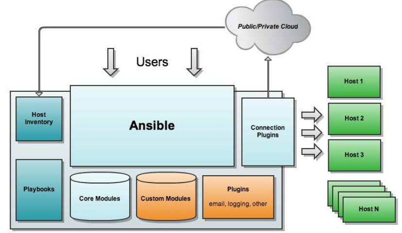
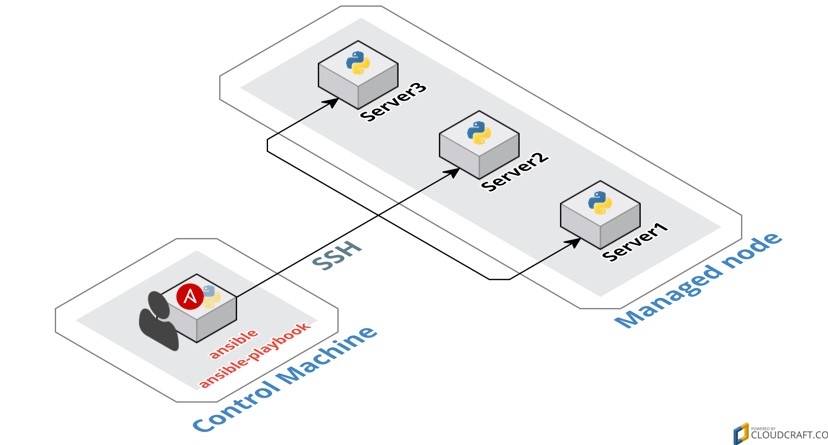

# Ansible 简介与安装配置

Ansible自动化运维工具，基于Python开发，集合了众多运维工具（puppet、cfengine、chef、func、fabric）的优点，实现了批量系统配置、批量程序部署、批量运行命令等功能。它主要基于ssh进⾏通信，不要求客户端(被控制端)安装Ansible。
## Ansible介绍
### 特点

* 拥有模块化的设计，Ansible能够调用特定的模块来完成特定任务 ，本身是核心组件，短小精悍
* Ansible的部署比较简单，agentless 无客户端工具
* 以主从模式工作
* 支持自定义模块功能
* 支持playbook剧本，连续任务按先后设置顺序完成
* 期望每个命令具有**幂等性**

### 基本架构

Ansible基本架构图如下所示：



* `Ansible` Ansible的核心程序
* `Host Inventory` 记录了每一个由Ansible管理的主机信息，信息包括ssh端口，root帐号密码，ip地址等等。可以通过file来加载，可以通过CMDB加载
* `Playbooks` YAML格式文件，多个任务定义在一个文件中，使用时可以统一调用，用来定义哪些主机需要调用哪些模块来完成的功能
* `Core Modules` Ansible执行任何管理任务都不是由Ansible自己完成，而是由核心模块完成；Ansible管理主机之前，先调用core Modules中的模块，然后指明管理Host Inventory中的主机，就可以完成管理主机
* `Custom Modules` 自定义模块，完成Ansible核心模块无法完成的功能，此模块支持任何语言编写
* `Connection Plugins` 连接插件，Ansible和Host通信使用

### 工作原理

Ansible通过**inventory档案**来定义有哪些**Managed node（被控端）**，并由**Control Machine（控制端）**通过**SSH（默认方式）**连上**Managed node**进行工作。



* `Control Machine`  指运行Ansible环境的机器，也可以叫做控制端

* `Mananged node`  指被Ansible操纵的机器，也可以叫做被控端


## Ansible安装与配置

### 部署安装

Ansible的安装方式有多种，下面以yum安装和笔者整理的rpm包安装为例进行安装。

#### Yum安装

1. 新增`epel-release` 第三方套件来源

   ```bash
   sudo yum install -y epel-release
   ```

2. 安装Ansible

   ```bash
   sudo yum install -y ansible
   ```

#### Rpm安装

首先下载Ansible及相关依赖的rpm包

[百度网盘链接](https://pan.baidu.com/s/18Z26AGhZ3WWtouzV97TYEA)  提取码：zoq9

下载后解压缩文件

```bash
tar -zxvf ansible.tar.gz
```

```bash
cd ansible
```

安装rpm包

```bash
sudo rpm -ivh *.rpm --force
```

安装完毕后输入`ansible-doc -h`命令列出相关的帮助，至此，Ansible安装已经完成，接下来简单介绍下ansible的使用。

### 命令及文件清单

* `/usr/bin/ansible` Ansibe AD-Hoc 临时命令执行工具，常用于临时命令的执行
* `/usr/bin/ansible-doc` Ansible 模块功能查看工具
* `/usr/bin/ansible-galaxy` 下载/上传优秀代码或Roles模块的官网平台，基于网络的
* `/usr/bin/ansible-playbook` Ansible 定制自动化的任务集编排工具
* `/usr/bin/ansible-pull` Ansible远程执行命令的工具（使用较少，海量机器时使用，对运维的架构能力要求较高）
* `/usr/bin/ansible-vault` Ansible 文件加密工具
* `/usr/bin/ansible-console` Ansible基于Linux Consoble界面可与用户交互的命令执行工具
* `/usr/share/ansible_plugins` Ansible高级自定义插件目录（需要python基础）
* `/etc/ansible/ansible.cfg` Ansible配置文件
* `/etc/ansible/hosts ` Ansible主机清单

### 初次上手

#### 上传公钥

```bash
ssh-keygen -t rsa -f ~/.ssh/id_rsa -N ''
ssh-copy-id root@172.16.33.96
ssh-copy-id root@172.16.33.97
```

>  注意：笔者在本地环境上传公钥遇到了一个坑，解决方案放出。
>
> * 问题描述
>
>   笔者在制作了公钥并上传到了目标服务器后，通过`ssh root@172.16.33.96`命令访问目标机器仍然提示输入密码。Google了好久得到的方案无非是修改.ssh和authorized_keys的目录权限以及修改sshd的配置文件，都没有得以解决。
>
> * 解决方案
>
>   经过慢慢排查，发现该现象是SELinux造成的，关闭SELinux即可解决。
>
>   暂时关闭（重启不生效）：
>
>   ```bash
>   setenforce 0
>   ```
>
>   永久关闭（重启后生效）：
>
>   ```bash
>   vi /etc/selinux/config  
>   SELINUX=disabled  
>   ```


#### 配置hosts

编辑ansible的hosts文件

```bash
sudo vi /etc/ansible/hosts
```

在文件末添加如下内容

```
[test]
172.16.33.96
172.16.33.97
```

#### 执行ansible命令

配置完毕后，即可通过ansible执行命令管理被控端了：

```bash
ansible test -m ping
```


**以上内容简单介绍了Ansible的特点、架构、原理、安装和简单的上手操作，后续章节将介绍Ansible的命令选项和常用模块，未完待续...**