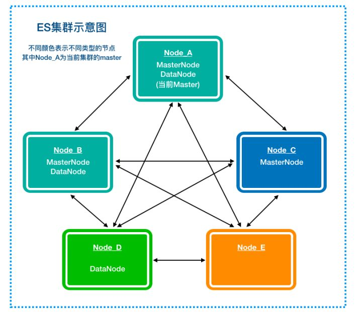
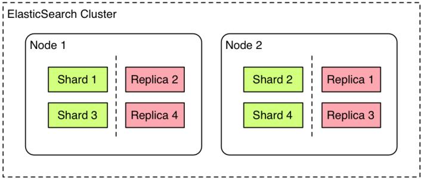

# Elasticsearch教程-基本概念

### Cluster(集群)

- 集群可以由一个或者任意多个节点组成
- 集群中每个节点拥有部分数据，所有节点一起拥有全部数据
- 集群提供跨所有节点的索引和搜索功能
- 集群名称(默认为**elasticsearch**)相同的节点会加入同一个集群，**必须避免**不同的集群使用相同的名称

集群会通过选举产生一个Master节点，其主要作用之一，就是决定哪些分片被分配到哪些节点，以及何时在节点间移动分片以重新平衡集群。

### Node(节点)

- 启动Elasticsearch服务产生的实例就是一个节点
- 启动时默认会分配一个随机的UUID作为节点名称
- 可通过配置节点的集群名称(默认为**elasticsearch**)来加入一个特定的集群，多个拥有相同集群名称的节点会自动连接组成集群
- 一个集群可以由任意多个节点组成，如果没有其他节点拥有相同的集群名称，启动一个新节点默认会产生一个对应集群名称(默认为**elasticsearch**)的集群
- 所有节点都知道集群中的其他节点，并且能够把客户端请求转发到适当的节点
- 节点有候选主节点、数据节点、预处理节点和协调节点几种类型(一个节点默认即为候选主节点，又是数据节点，还是预处理节点)，集群规模很大的时候，合理地区分/分配节点的角色是非常重要的

### Index(索引)

- 索引相当于关系型数据库的数据库
  
  | 类型          |           |        |           |         |
  | ------------- | --------- | ------ | --------- | ------- |
  | 关系型数据库  | Databases | Tables | Rows      | Columns |
  | Elasticsearch | Indices   | Types  | Documents | Fields  |

- 索引只是一个用来指向一个或者多个分片的"逻辑命名空间"

- 一个集群中可以定义任意多个索引

- 索引名称必须为小写

### Type(类型)

- 类型(type)是用来在同一个索引中存储不同类型文档的逻辑分类/划分，**<u>从6.0.0版本开始被弃用</u>**
- 从6.x版本开始，一个索引只允许包含一个类型(type)
- 同一个索引中拥有相同名称字段的不同类型(type)，在内部却是使用一样的Lucene字段存储，因此不同的类型(type)也应该有相似的结构(schema)，比如名称相同的字段不能既是字符串又是数值

### Document(文档)

- 索引里面的每一条记录称为文档，文档是可以被索引的基本信息单元
- 在Elasticsearch中，文档特指最顶层结构或者根对象序列化成的JSON数据
- 同一个索引里面的文档，不严格要求有相同的结构(schema)，结构相同时搜索效率最高

### Mapping(映射)

- 类似于关系型数据库中的表结构
- 映射定义了文档及其包含的字段如何被索引和存储

### Shards(分片)

- 一个索引有可能存储了非常大量的数据，这些数据超过了单一节点的硬件存储能力
- 一个索引可以被切分为很多部分，每个部分称为一个分片
- 一个分片是一个全功能的独立的(Lucene)索引，可以被存储在任何一个节点上
- 创建索引的时候，可以指定(主)分片的数量(不可更改)
- 利用分片，可以横向拆分/扩展索引的内容量，可以跨分片(有可能是多节点)达到分布式的并行操作以增加性能和吞吐

### Replicas(复制分片)

- 复制分片是分片的副本

- 提供了分片或者节点失败情况下的高可用性(复制分片永远不会与其对应分片存在于同一个节点)

- 扩展了搜索能力，因为搜索请求可以在所有的分片/复制分片上被并行执行

- 可以通过API动态修改索引的复制分片数量

- 每一个索引默认拥有5个(主)分片和1个复制分片

